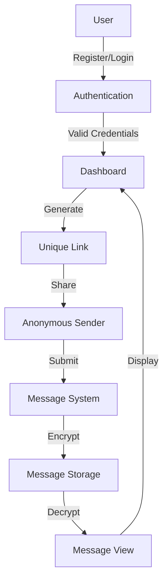

# Anonymous Messages Platform

A secure web application that allows users to receive anonymous messages through a unique, shareable link. Built with Flask and modern web technologies.

## Features

- 🔐 **Secure Authentication**
  - 6-digit PIN-based authentication
  - Secure password hashing using Werkzeug
  - Session-based user management

- 🔒 **Message Security**
  - End-to-end message encryption
  - Messages are encrypted using recipient's credentials
  - Only message owners can decrypt and view their messages

- 🎯 **User-Friendly Interface**
  - Clean, modern UI using Tailwind CSS
  - Responsive design for all devices
  - Intuitive message management dashboard

- 📱 **Easy Message Sharing**
  - Generate unique, shareable links
  - One-click link copying
  - Anonymous message submission

## System Architecture



## Security Features

1. **PIN Security**
   - 6-digit numeric PIN requirement
   - Secure hashing using Werkzeug's security functions
   - Protection against brute force attacks

2. **Message Encryption**
   - Messages encrypted using recipient's credentials
   - Fernet symmetric encryption
   - Secure key generation and management

3. **Session Management**
   - Secure session handling
   - Automatic session expiration
   - Protection against session hijacking

## Installation

1. Clone the repository:
```bash
git clone https://github.com/yourusername/anonymous-messages.git
cd anonymous-messages
```

2. Create a virtual environment:
```bash
python -m venv venv
source venv/bin/activate  # On Windows: venv\Scripts\activate
```

3. Install dependencies:
```bash
pip install -r requirements.txt
```

4. Run the application:
```bash
python app.py
```

## Project Structure

```
anonymous-messages/
├── app.py              # Main application file
├── requirements.txt    # Project dependencies
├── static/            # Static files (CSS, JS)
├── templates/         # HTML templates
│   ├── index.html    # Landing page
│   ├── login.html    # Login page
│   ├── register.html # Registration page
│   ├── dashboard.html # User dashboard
│   ├── message.html  # Message submission page
│   └── view.html     # Message viewing page
├── messages/         # Encrypted message storage
└── users/           # User data storage
```

## Usage

1. **Registration**
   - Create an account with username and 6-digit PIN
   - PIN must be exactly 6 digits (0-9)

2. **Dashboard**
   - Generate your unique message link
   - View message count and access messages
   - Copy and share your link

3. **Receiving Messages**
   - Share your unique link
   - Others can send anonymous messages
   - Messages are automatically encrypted

4. **Viewing Messages**
   - Access your messages through the dashboard
   - Messages are automatically decrypted
   - View message history with timestamps

## Security Considerations

- All PINs are stored as secure hashes
- Messages are encrypted using recipient's credentials
- Session management with secure cookies
- Protection against common web vulnerabilities

## Contributing

1. Fork the repository
2. Create your feature branch (`git checkout -b feature/AmazingFeature`)
3. Commit your changes (`git commit -m 'Add some AmazingFeature'`)
4. Push to the branch (`git push origin feature/AmazingFeature`)
5. Open a Pull Request

## License

This project is licensed under the MIT License - see the [LICENSE](LICENSE) file for details.

## Acknowledgments

- Flask web framework
- Tailwind CSS for styling
- Werkzeug for security features
- Cryptography library for message encryption 