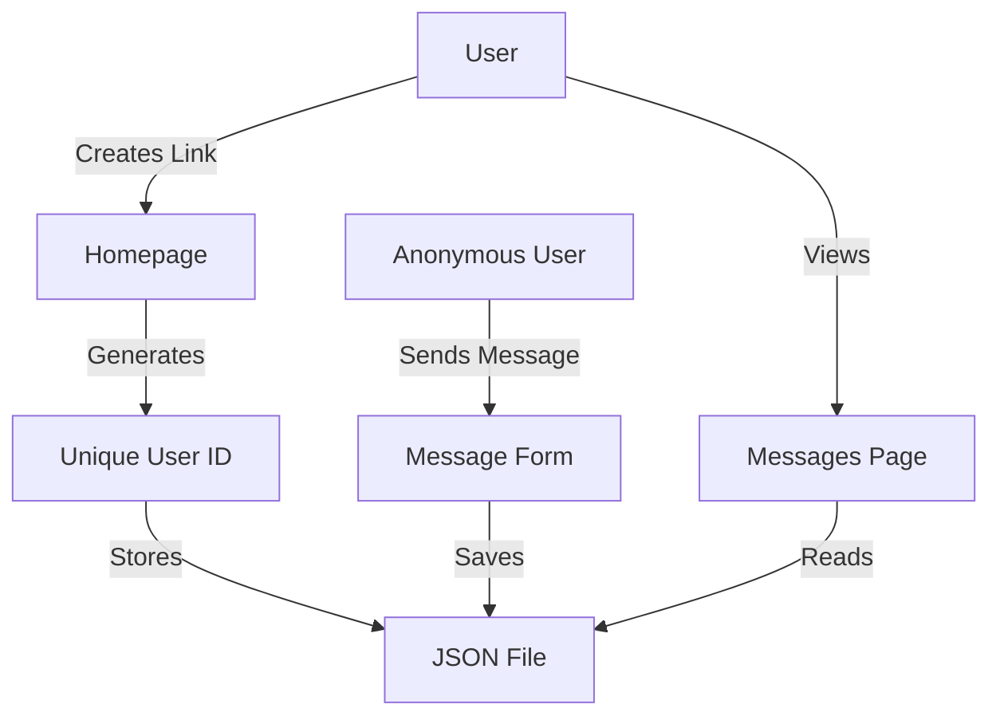

# Anonymous Messages

A simple web application that allows users to create a unique link where others can send them anonymous messages.

## 🌟 Features

- Create a unique link to receive anonymous messages
- Send anonymous messages through a simple form
- View all received messages
- Modern and responsive design using Tailwind CSS
- No registration required
- Real-time message delivery
- Copy link to clipboard functionality

## 🏗️ Architecture



## 📁 Project Structure

```
anonymous-messages/
├── app.py              # Main Flask application
├── requirements.txt    # Python dependencies
├── static/            # Static files
│   └── style.css      # Custom styles
├── templates/         # HTML templates
│   ├── index.html     # Homepage
│   ├── message.html   # Message sending form
│   └── view.html      # Message viewing page
└── messages/          # Message storage (gitignored)
```

## 🚀 Setup

1. Clone the repository:
   ```bash
   git clone https://github.com/yourusername/anonymous-messages.git
   cd anonymous-messages
   ```

2. Create and activate a virtual environment:
   ```bash
   python -m venv venv
   # On Windows
   venv\Scripts\activate
   # On Unix or MacOS
   source venv/bin/activate
   ```

3. Install dependencies:
   ```bash
   pip install -r requirements.txt
   ```

4. Run the application:
   ```bash
   python app.py
   ```

5. Open your browser and visit `http://localhost:5000`

## 💻 How to Use

1. Visit the homepage and click "Create Your Link"
2. Share the generated link with anyone you want to receive messages from
3. People can visit your link and send you anonymous messages
4. View your messages by clicking the "View Messages" link

## 🔒 Security Considerations

This is a simple implementation for demonstration purposes. In a production environment, you would want to add:

- Rate limiting to prevent spam
- Message filtering for inappropriate content
- User authentication for message management
- HTTPS for secure communication
- Database instead of file storage
- Input sanitization
- CSRF protection
- XSS prevention

## 🤝 Contributing

1. Fork the repository
2. Create your feature branch (`git checkout -b feature/AmazingFeature`)
3. Commit your changes (`git commit -m 'Add some AmazingFeature'`)
4. Push to the branch (`git push origin feature/AmazingFeature`)
5. Open a Pull Request

## 📝 License

This project is licensed under the MIT License - see the [LICENSE](LICENSE) file for details.

## 🙏 Acknowledgments

- [Flask](https://flask.palletsprojects.com/) - Web framework
- [Tailwind CSS](https://tailwindcss.com/) - CSS framework
- [Mermaid](https://mermaid-js.github.io/) - Diagrams 